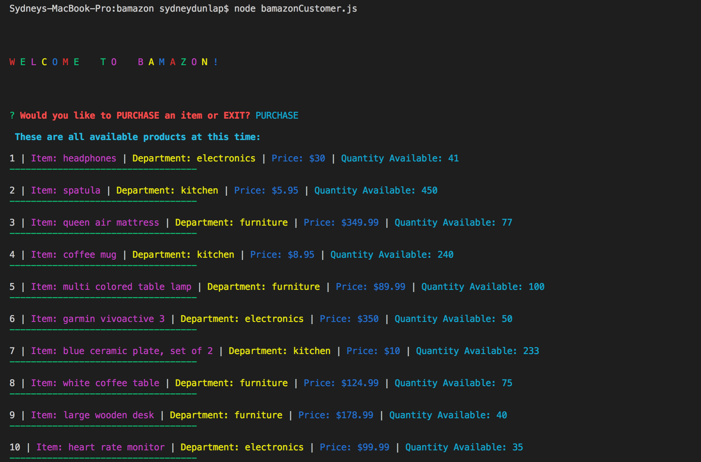
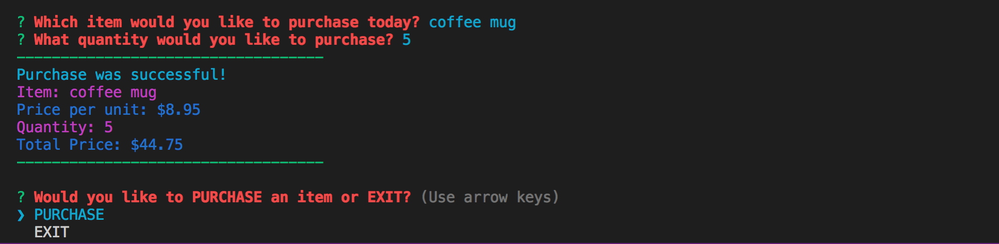
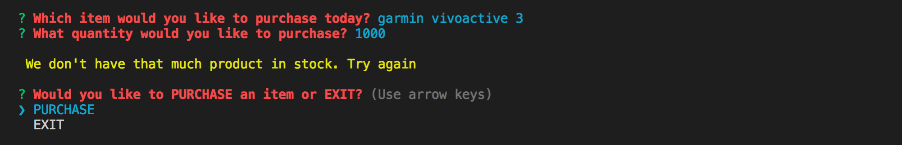
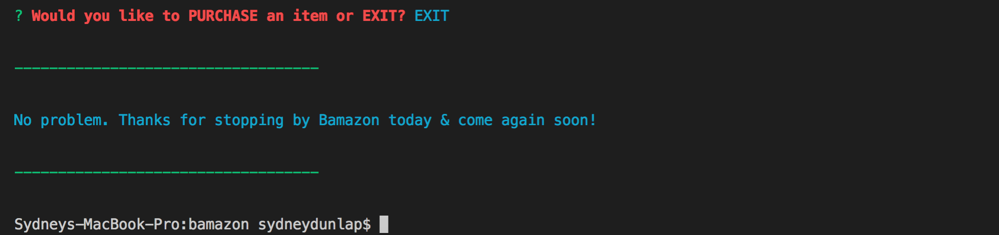
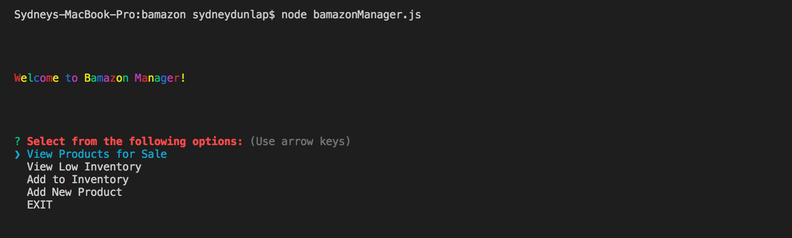
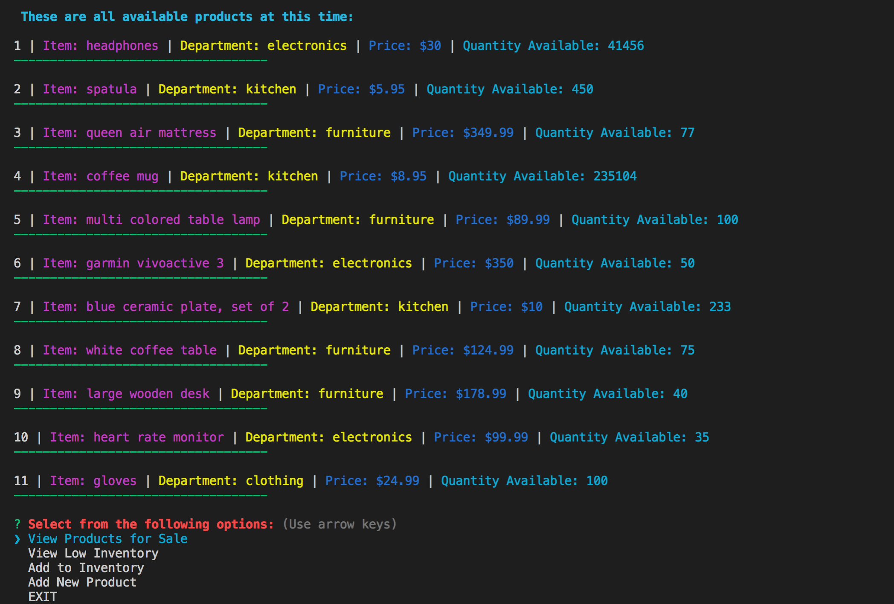
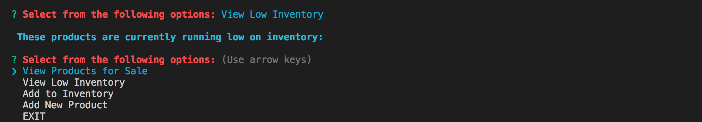
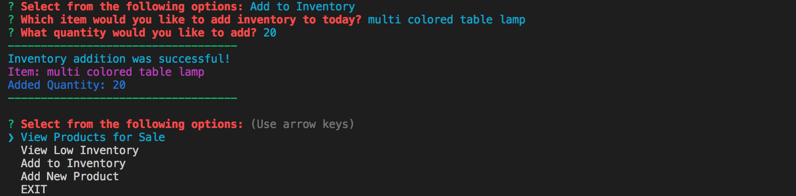
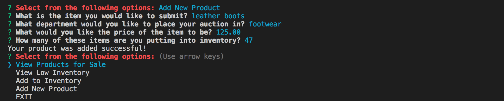
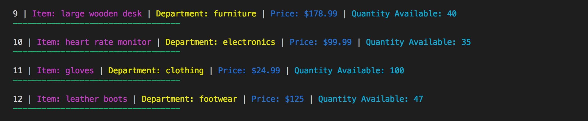

# Bamazon 

An Amazon-esque application that allows a user to view all products available to them, decide whether or not they want to purchase an item, and then decide on the quantity they would like to purchase. 

This application utilizes a MySQL Database in order to store product information. It is a node based application.

### Technologies Used

- JavaScript
- MySQL
- Node.js

## There are two parts of this application
- Bamazon for Customers
- Bamazon for Managers

### Bamazon for Customers
When the user prompts the application to run, it is first welcomed, then asked if they would like to purchase an item or exit the application. If purchase is selected, the available items will print to the console:

After the available items are printed, the application then asks the user which item they would like to purchase, with a list of choices the user can scroll through to select. Once an item is selected, they are prompted to enter a quantity. When a quantity is requested and there is enough quantity available in stock:

When a quantity is requested that is greater than the quantity available in stock:

The user is prompted after each purchase to purchase again or exit. If the user decides to exit the application:

### Bamazon for Managers
When the user prompts the manager application to run, it is first welcomed and then given a list of options to select from.

If "View Products for Sale" is selected:

If "View Low Inventory" is selected it will print any product with a stock quantity lower than five and if all products have a stock quantity greater than five:

If "Add to Inventory" is selected, the manager can add inventory to a specific product (from a list of choices the user can scroll through) by selecting the product & entering the quantity they would like to add.

If "Add New Product" is selected, the manager can add an entirely new product to their store. The manager is asked a series of questions about this product. To see that the product was added to the inventory, they can then choose to view all available products.

